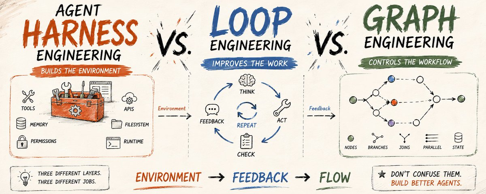
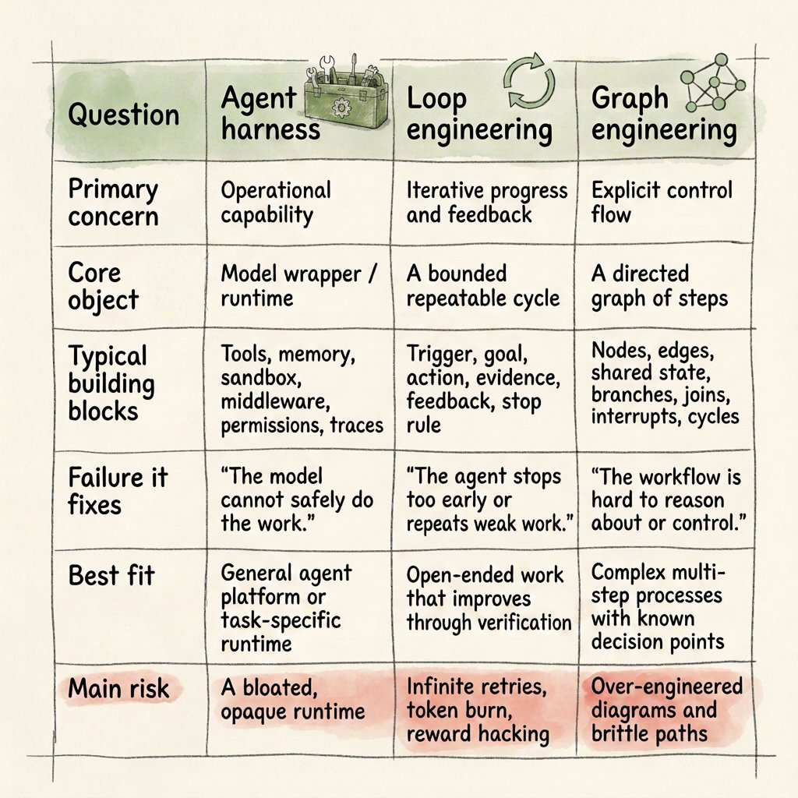
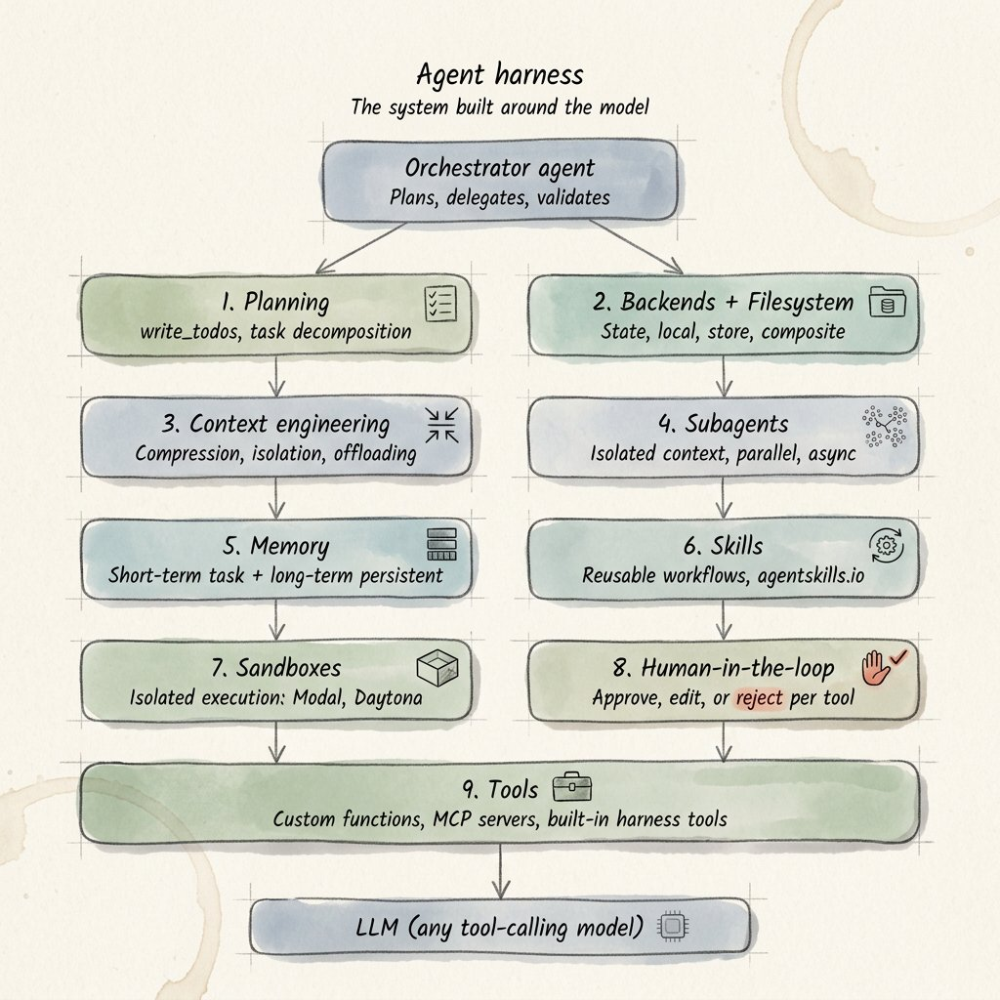
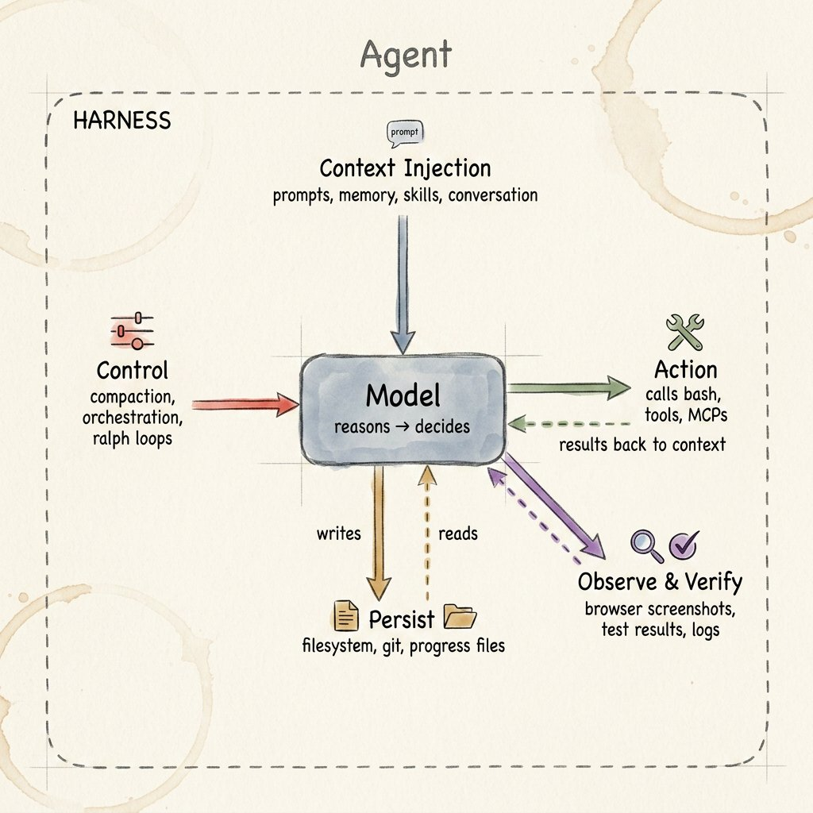
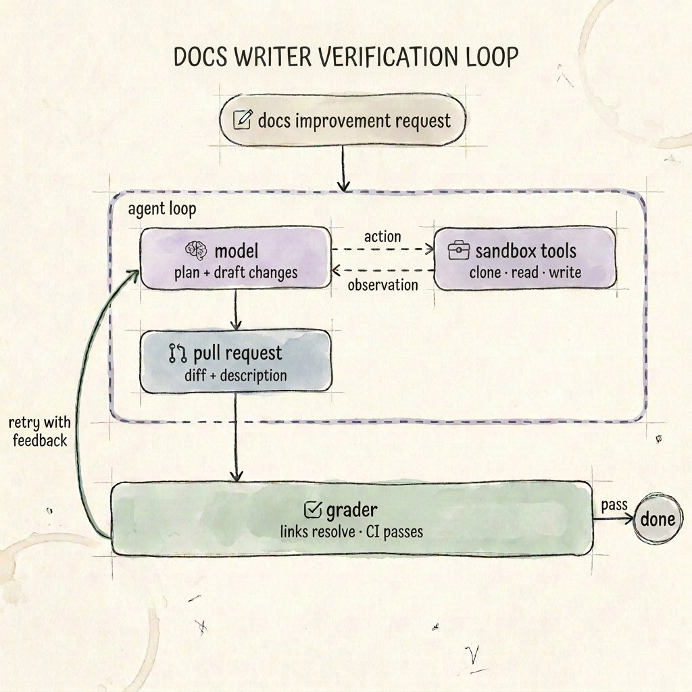
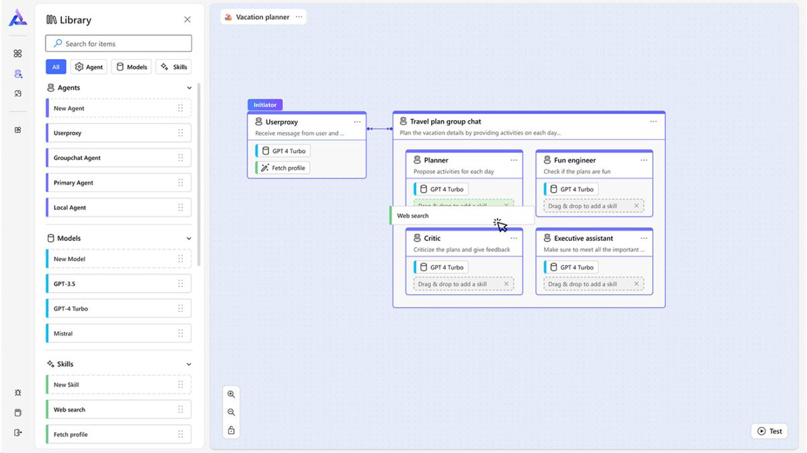
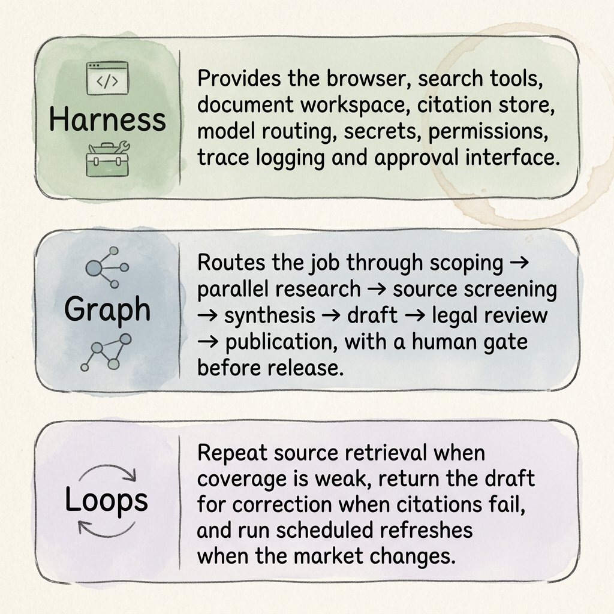

# 智能体运行框架工程、循环工程与图工程

> **原文标题**：Agent Harness Engineering vs. Loop Engineering vs. Graph Engineering  
> **作者**：[@beamnxw](https://x.com/beamnxw)  
> **原文发布日期**：2026 年 7 月 25 日  
> **原文链接**：[x.com/beamnxw/status/2081022966645535079](https://x.com/beamnxw/status/2081022966645535079)  
> **分类**：AI Agent、智能体架构、软件工程  
> **说明**：本文为非官方中文翻译，按原文章节逐段翻译；原文配图已一并归档并嵌入。为便于理解，文中的 **Harness** 译为“智能体运行框架”，也可理解为智能体的运行外壳或支架。

*一份实用指南，解释人们总是混为一谈的三层架构。*

这种混淆可以理解。这三个概念都围绕同一个模型展开，都会影响可靠性，也都可能包含“循环”。但它们不是同义词。它们描述的是不同的工程决策；当智能体离开演示 Notebook，开始接触文件、API、客户或生产代码时，这种区别就会变得重要。

> **30 秒答案**

- **Harness Engineering（智能体运行框架工程）**：构建模型周围的运行机制。
- **Loop Engineering（循环工程）**：设计重复执行、工作与反馈的周期。
- **Graph Engineering（图工程）**：把工作流拓扑显式表达出来，包括节点、分支、汇合、状态转换和受控循环。

**最简洁的心智模型是：环境 → 反馈 → 流程。**

---

## 为什么这些术语突然变得重要

单独的裸语言模型无法直接在真实环境中创建文本文件、维护项目状态、运行测试套件、查看浏览器、执行审批规则，或重启失败的任务。这些能力来自模型所处的环境。

随着智能体软件逐渐成熟，一套标准的工程技术栈终于开始成形。最底层是 **Agent Harness**，即真正运行模型的代码；再往上是 **Loops**，负责重复执行和质量检查；最后是 **Graphs**，用结构化路径描述整个流程如何推进。

这些名称目前仍未完全标准化。在当前框架中，“Agent Harness”正逐渐形成相对明确的含义；“Loop Engineering”则是 2026 年在实践者中出现的较新术语。“Graph Engineering”应该从实用角度理解，而不是把它视为一门学术领域：它就是把智能体工作流构建成显式有向图或状态机的过程。

这种实用区分很有帮助，因为它能防止流行术语掩盖真正的设计问题。

---

## 智能体运行框架工程

- 按照 LangChain 的说法，**智能体就是模型加上 Harness**；Harness 是模型之外的代码、配置和执行逻辑。实际系统中，它包括系统提示词、工具定义、记忆、文件系统、沙箱、模型路由、任务交接、中间件钩子、上下文压缩、权限、日志和验证接口。
- OpenAI Agents SDK 从运行时角度描述了同一套操作核心：Runner 调用模型、执行工具调用、处理任务交接、携带状态，并且只有在一次运行到达真正的终止条件时才停止。

“Harness”这个词很有用，因为它把注意力从对模型的崇拜上移开。两个团队可以使用同一个基础模型，却得到截然不同的结果：一个团队给模型提供清晰的工具、稳定的工作区、受约束的权限和可观察的状态；另一个团队则只给它模糊的提示词和不可靠的 API 包装层。两边的智能程度可能相近，但工作条件并不相同。

**一个成熟的 Harness 通常包含：**

- **上下文注入（Context injection）**：指令、检索到的事实、对话状态、Skills 和任务专用策略。
- **行动接口（Action surfaces）**：API、浏览器、Shell、代码解释器、数据库和兼容 MCP 的工具。
- **持久化（Persistence）**：文件、检查点、会话、进度日志、Git 历史和长期记忆。
- **执行控制（Execution control）**：超时、重试、预算、模型路由、子智能体生成和审批关卡。
- **安全与治理（Safety and governance）**：权限、隔离、允许列表、密钥处理和人工授权。
- **可观测性（Observability）**：执行轨迹、工具输入输出、状态转换、成本、延迟和评估结果。

模型位于一个更大的 Harness 之中，这个 Harness 提供上下文、控制、行动、持久化和验证。试着把模型从你的架构图中拿掉：剩下的一切很可能都属于 Harness——工具、数据访问、状态存储、沙箱、中间件、评估器、重试策略和用户界面。

> **Harness 工程在什么地方最能体现价值**

Harness 工程对长期运行的任务尤其重要。在多会话编码中，Anthropic 发现，仅使用上下文压缩并不足够。他们解决问题的方式并不是单纯写出更好的提示词，而是建立一套良好的工作环境：创建初始化程序、进度文件和 Git 历史，并采用增量工作的纪律，让每个新上下文都能理解之前发生了什么、还有什么没有完成。

这是一套围绕智能体改进过的工作系统。

当智能体缺少某项能力、无法干净地恢复工作、丢失状态、访问权限过宽、无法审计，或在不同环境中行为不一致时，就应该应用 Harness 工程。

---

## 循环工程

每一个使用工具的智能体，内部都嵌着一个小循环：

1. 调用模型；
2. 查看结果；
3. 运行工具；
4. 把观察结果输入模型；
5. 重复执行，直到返回最终答案。

当开发者有意识地围绕这一行为构建或叠加新的循环时，就进入了 OpenAI 所称的“循环工程”。

例如，**验证循环**允许智能体先创建一个产物，再运行确定性检查或评估器，接收明确反馈，并且只有在证据表明存在错误时才重试。**事件驱动循环**会在收到计划任务、Webhook 或新文档时唤醒智能体。**改进循环**则分析执行轨迹和失败，修改指令或工具，然后测试新版本是否真的更好。

LangChain 在 2026 年提出的框架，把它描述为一组相互叠加的循环，而不是某一条神奇的 `while` 语句。

> **一个设计良好的循环由什么组成**

- **触发器（Trigger）**：什么会启动下一轮循环——用户请求、计划任务、失败的测试、新数据或评估器反馈。
- **目标（Goal）**：要到达的具体状态，而不是含糊地要求“继续改进”。
- **状态与记忆（State and memory）**：下一轮需要知道什么，同时不必重放全部历史。
- **行动策略（Action policy）**：智能体可以修改什么、调用什么、委派什么，以及可以花费多少资源。
- **证据（Evidence）**：测试、Schema 校验、引用、Diff、指标或人工评审。
- **反馈（Feedback）**：对证据为何未通过作出简洁、可执行的说明。
- **停止规则（Stopping rule）**：成功、达到预算上限、超时、不可恢复错误或升级给人工处理。

验证循环是在基础智能体循环外部，再包上一层外部评估器和明确的通过条件。

**不要根据“信心”循环，要根据“证据”循环。**“智能体说它已经完成”不是停止条件；“测试通过、链接可以访问、Schema 校验成功并且审查者批准”才是。

> **为什么循环工程不只是提示词工程**

提示词告诉模型在一次调用中应该做什么。循环规定的是系统在调用结束后做什么：

> 它如何观察结果、选择反馈、决定是否继续、持久化进度，以及终止执行。

提示词质量仍然重要，但循环把一次性指令转化为一个受管理的过程。主要取舍是成本和延迟：每增加一个评估器、审查者或重试步骤，就会增加一次模型调用或工具运行。

Anthropic 更广泛的建议是，优先选择能够解决问题的最简单架构；只有当性能收益足以证明其合理性时，才增加智能体复杂度。同样的建议也适用于循环：只在失败成本高于验证成本的地方增加循环。

---

## 图工程

图工程提出的是另一个问题：不仅要决定智能体做什么，还要决定**接下来允许哪个组件运行**。

步骤由节点表示，允许发生的转换由边表示。边可以表达顺序执行、条件分支、并行扇出、汇合、循环和人工中断。状态沿着图移动，而拓扑结构让系统能够检查预期控制流是否得到遵守。

LangGraph 是面向长期、有状态智能体的底层编排基础设施，提供持久化执行、状态和人在回路控制；它明确强调对智能体的控制，而不是把工作流抽象隐藏起来。

Microsoft AutoGen 的文档给出了非常直接的判断标准：当你需要精确控制智能体顺序、让不同结果进入不同后续步骤、使用确定性分支，或构建包含循环的复杂多步骤流程时，就使用图。

**图工程师真正需要决定的事情包括：**

- **节点边界（Node boundaries）**：哪些工作属于确定性函数、LLM 调用、专业智能体或人工评审步骤。
- **状态 Schema（State schema）**：每个节点可以读取或更新什么，以及并行更新如何合并。
- **路由条件（Routing conditions）**：哪些证据会让工作向前、向后、横向移动，或升级处理。
- **并发（Concurrency）**：哪些工作可以并行、哪些必须汇合，以及哪些共享资源需要协调。
- **循环与出口（Cycles and exits）**：哪些位置允许重试、允许重试多少次，以及什么条件能让循环保持安全。
- **持久化（Durability）**：在哪里创建检查点，以及中断后如何恢复执行。

上面的画布让智能体、Skills 和它们之间的关系能够作为一个组合系统被检查。这里所说的图工程，是对基于图的执行过程进行工程设计；它不同于知识图谱工程。知识图谱中的图表示数据里的实体和关系，而工作流图表示控制流程与状态转换。

> **什么时候值得为图付出这些额外工作**

当流程包含有意义的分支、并行工作、审批、恢复路径或多个专业智能体时，图很有价值。如果任务只是“给一个智能体三个工具，然后让它工作”，图的帮助就没那么大。

图可以改善调试，却也可能过早固化假设。如果模型必须动态制定计划，强行把所有可能路径预先塞进一张图里，可能会让系统更加脆弱，而不是更加可靠。

> **三层架构如何在一个真实系统中协同工作**

设想一个研究与发布智能体，它负责制作一份基于事实的行业简报。

注意它们的嵌套关系：**图运行在 Harness 之内；一个或多个循环存在于图中；Harness 则为这些循环提供所需的状态、工具和评估器。**

这些类别之所以会重叠，是因为软件层本来就会重叠。但当系统发生故障时，每一层仍然为团队提供了不同的调节手段。

> **根据故障诊断选择工程层**

| 症状 | 从哪里入手 | 可能的修复方式 |
|---|---|---|
| 智能体无法安全访问正确的数据或工具 | Harness | 工具契约、权限、沙箱、上下文注入 |
| 智能体跨会话忘记进度 | Harness | 持久状态、检查点、进度产物、上下文压缩 |
| 第一次尝试通常接近正确，但不够可靠 | Loop | 外部评估器、确定性测试、反馈和有限重试 |
| 智能体成功后仍继续工作，或在拿出证据前就停止 | Loop | 基于证据的终止状态和考虑预算的停止规则 |
| 多个专业智能体必须按受控顺序运行 | Graph | 显式节点、边、路由条件和汇合点 |
| 多步骤流程中的故障很难定位 | Graph + Harness | 将带状态的执行轨迹与图节点和状态转换对齐 |
| 工作流变化过于频繁，不适合固定图 | 更简单的 Harness | 保持模型驱动的控制方式，推迟图式化 |

---

## 薄弱智能体架构背后的高昂错误

> **在理解工作之前就构建图**

有些团队还没有观察到一个有能力的智能体究竟会怎样解决任务，就先把业务流程翻译成数十个节点。应该先从更简单的 Harness 中收集执行轨迹，再把其中稳定的路径正式图式化。

> **在没有防护措施的情况下，让同一个模型同时负责编写和评分**

自我审查可能有所帮助，但它容易受到共同盲区的影响。只要可能，就应优先使用确定性检查；为审查者提供独立上下文；对高影响操作要求人工批准。

> **把“继续尝试”当成循环规格**

无边界的重试循环会持续泄漏成本。每一个循环都需要可衡量的目标、新的证据、最大尝试次数，以及明确指定的升级路径。

> **把 Harness 当成垃圾场**

更多工具和记忆并不会自动带来更好的结果。拥挤的工具集会增加工具选择错误；嘈杂的上下文会增加混乱；过宽的权限会增加风险。

> **把编排故障归咎于模型**

模型无法可靠地弥补过期状态、含糊的工具 Schema、损坏的 API 或缺失的退出条件。应该改进真正拥有该故障的工程层。

### 面向生产环境的设计清单

- **Harness**：工具是否足够聚焦、有文档且可观察？状态是否持久？权限是否遵循最小权限原则？运维人员能否暂停、检查和恢复一次运行？
- **Loop**：什么证据可以证明成功？失败后会返回什么反馈？允许重试多少次？预算耗尽时会发生什么？
- **Graph**：哪些路径必须是确定性的？哪些工作可以并行？哪些状态需要共享？人工关卡和恢复路径在哪里？
- **Evaluation**：团队能否重放真实执行轨迹、比较不同版本，并把改进归因于某项具体变化，而不是依靠直觉？
- **Operations**：生产环境是否监控成本、延迟、失败率、干预率和任务级成功率？

### 记住三者区别的最简单方法

Harness 工程围绕模型构建系统，让模型能够真正运行。循环工程让工作变得可迭代、可验证并可恢复。图工程则让复杂执行路径变得显式且可控。

三者无法互相替代。如果 Harness 丢失了状态，再漂亮的图也不够；如果没有证据或停止规则，即便拥有最好的 Harness，也只会浪费金钱；如果分支、并行和审批都隐藏在临时代码中，即使循环设计得很精细，也依然难以操作。

只要团队理解每一层应该解决什么问题，并把这三层放在一起设计，就能构建出可靠的智能体系统。

## 读者常用的搜索词

- `agent harness vs loop engineering`
- `graph engineering for AI agents`
- `AI agent orchestration`
- `LLM agent architecture`
- `production AI agents`
- `LangGraph workflows`
- `AutoGen GraphFlow`
- `agent verification loops`

---

### 来源与延伸阅读

- [**The Anatomy of an Agent Harness**](https://www.langchain.com/blog/the-anatomy-of-an-agent-harness)：了解 Agent Harness 如何把 AI 模型转变为自主工作引擎，并探索文件系统、沙箱和记忆等核心组件。
- [**Agents SDK | OpenAI API**](https://developers.openai.com/api/docs/guides/agents)：了解 OpenAI Agents SDK 的组成方式，以及下一步应该阅读哪些文档。
- [**LangChain and LangGraph Agent Frameworks Reach v1.0 Milestones**](https://www.langchain.com/blog/langchain-langgraph-1dot0)：LangChain 1.0 与 LangGraph 1.0 已经发布；通过标准化工具、中间件定制和持久状态，更快构建面向生产环境的 AI 智能体。
- [**GraphFlow (Workflows) — AutoGen**](https://microsoft.github.io/autogen/stable/user-guide/agentchat-user-guide/graph-flow.html)：介绍如何创建多智能体工作流（简称 Flow），通过结构化执行精确控制智能体如何协作完成任务。
- [**The Art of Loop Engineering**](https://www.langchain.com/blog/the-art-of-loop-engineering)：智能体可以自动化现实工作，但可靠表现不仅需要优秀模型，还需要面向具体任务精心设计的 Harness。文章介绍基础智能体循环、如何通过叠加与扩展循环提高效果，以及如何使用 LangChain 原语观测各层循环。
- [**Introducing AutoGen Studio from Microsoft Research**](https://www.microsoft.com/en-us/research/blog/introducing-autogen-studio-a-low-code-interface-for-building-multi-agent-workflows/)：AutoGen Studio 基于 Microsoft 灵活的开源多智能体编排框架 AutoGen，提供易用界面，让开发者只需少量代码甚至无需编码，就能快速构建、测试、定制和分享多智能体 AI 方案。
- [**How to Build a Custom Agent Harness**](https://www.langchain.com/blog/how-to-build-a-custom-agent-harness)：有效的智能体需要与当前任务紧密耦合的 Harness。最简单的自定义方式是使用 LangChain 的 `create_agent` 和中间件；该指南还介绍了基础智能体循环及其定制方法。
- [**A Practical Guide to Building Agents**](https://openai.com/business/guides-and-resources/a-practical-guide-to-building-ai-agents)：一份关于智能体设计、编排和部署的综合指南，涵盖用例、模型选择、工具设计、安全护栏与多智能体模式。
- [**Building Effective AI Agents**](https://resources.anthropic.com/building-effective-ai-agents)：Anthropic 及其客户关于构建生产级单智能体和多智能体系统的实践建议。

---

*保存本文，以免之后找不到。*

*关注 [@beamnxw](https://x.com/beamnxw) 获取更多技术文章，也可查看作者的 [Telegram 频道](https://t.me/beamnxw11)。*
